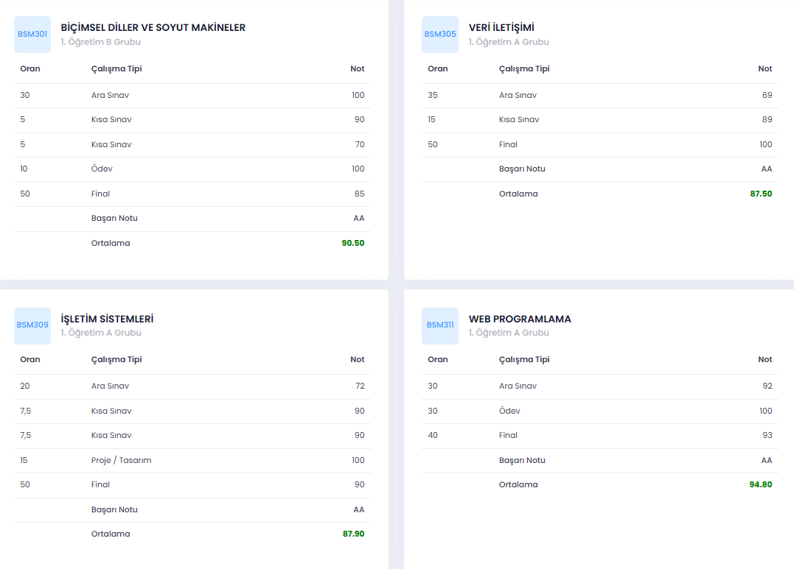
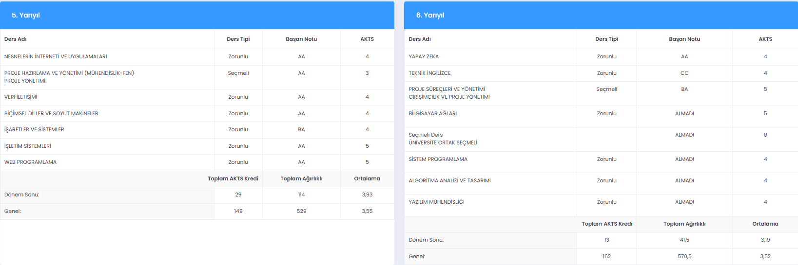
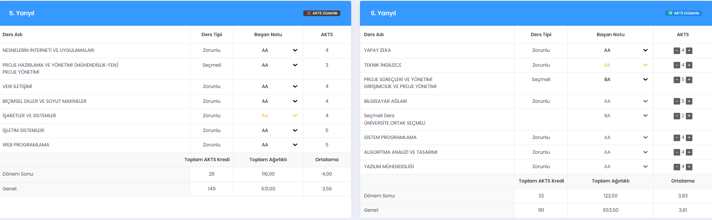

# SABİS GPA Hesaplayıcı (Smart Grade Assistant) 🚀

Sakarya Üniversitesi öğrencileri için geliştirilmiş bu Chrome/Edge
uzantısı, **SABİS** “Ders” ve “Transkript” sayfalarında;

* **Eksik notları girerek** “ne olurdu?” senaryoları oluşturmanıza  
* **AKTS kredilerini düzenleyip** gerçekçi dönem–genel GPA simülasyonları yapmanıza  
* Tüm bunları **renkli, anlık geri bildirimle** takip etmenize olanak tanır.

---

## Kurulum (Geliştirici Mod)

1. Depoyu ZIP olarak indirin veya `git clone` yapın.  
2. Tarayıcıda `chrome://extensions` → **Geliştirici modu**nu açın.  
3. **“Paketlenmemiş uzantı yükle”** → proje kök klasörünü seçin (içinde `manifest.json` var).  
4. Mavi uzantı simgesi göründüğünde kurulum tamamdır.

---

## Özellikler

| # | Açıklama |
|---|----------|
| **1 – Dinamik Not Kutuları** | Notu girilmemiş hücrelerde otomatik **textbox** (0 – 100). |
| **2 – Giriş Doğrulama** | 0–100 dışı veya harf/özel karakter girişi engellenir. |
| **3 – Canlı GPA Hesabı** | Her değişiklikte **dönem ve genel** GPA anında güncellenir. • **Yeşil ≥ 75** • **Mavi 55–74** • **Kırmızı &lt; 55** |
| **4 – AKTS Düzenle Toggle** | Kart başlığındaki **❌ / ✅ AKTS Düzenle**  → AKTS hücrelerinde − / ＋ butonları & doğrudan sayı girişi → Tek tıkla orijinal değere sıfırla |
| **5 – “Ortalamaya Girmez”** | Yıldız `*` işaretli dersler (STAJ I, II …) otomatik **hesap dışı** tutulur. |

---

## Önce / Sonra

| Önce | Sonra |
|:--:|:--:|
|  |  |
|  |  |
---

## Klasör Yapısı

